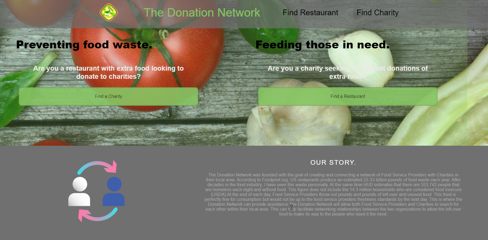

# Donation Network
Group Project 1

## website url 
https://mgweber25.github.io/groupProject1/

## Description
The Donation Network was founded with the goal of creating and connecting a network of Food Service Providers with Charities in their local area. According to Foodprint.org, US restaurants produce an estimated 22-33 billion pounds of food waste each year. After decades in the food industry, I have seen this waste personally. At the same time HUD estimates that there are 553,742 people that are homeless each night and without food. This figure does not include the 14.3 million households who are considered food insecure (USDA).At the end of each day, Food Service Providers throw out pounds and pounds of left over and unused food. This food is perfectly fine for consumption but would not be up to the food service providers freshness standards by the next day. This is where the Donation Network can provide assistance.The Donation Network will allow both Food Service Providers and Charities to search for each other within their local area. This can help facilitate networking relationships between the two organizations to allow the left-over food to make its way to the people who need it the most.

As a restaurant with extra food
We want a way to find charities to donate leftover food to
so that food does not go to waste and people are fed.

As a charity with hungry people
We want a way to find restaurants that may have extra food
so that we can feed people in need.

## Screenshot

## Technologies Used
Pure CSS - Pure is a CSS Framework from Yahoo! that focuses on the structure and formatting of a website. This allows for flexible styling through manual CSS while having the clean look of a bootstrap designed page. 

OpenTable API - The Open Table API allows for clean search of restuarants in an area.

CharityNavigator API - a great resource for finding information about charities in a given area. 

